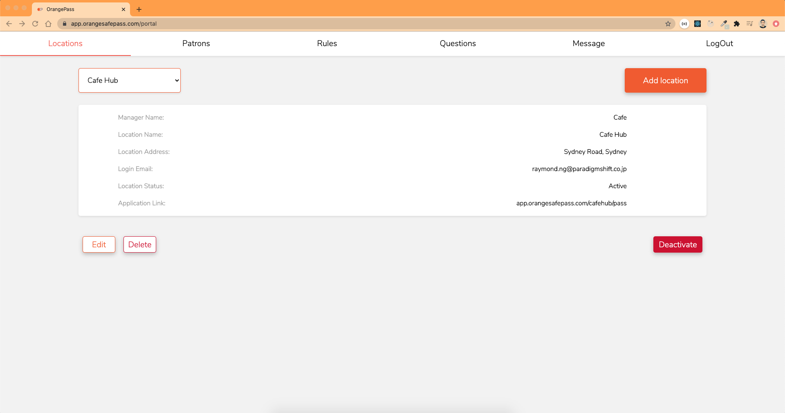
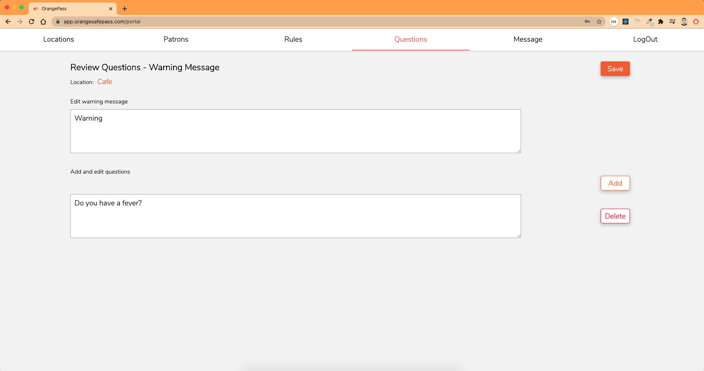
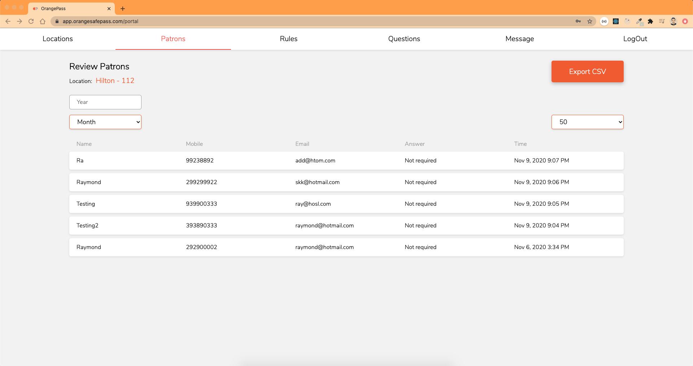
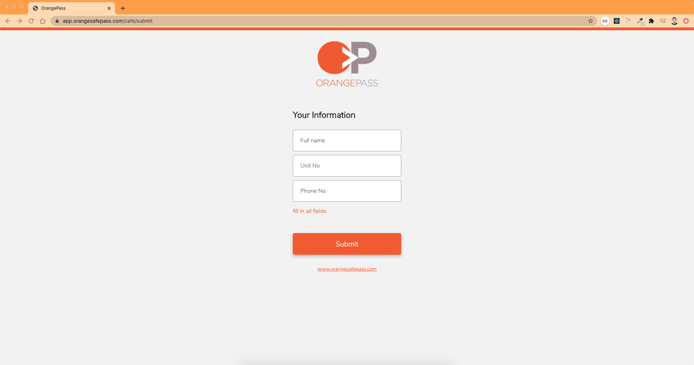

## `Orange Pass`

OrangePass is a helpful tool developed for venues, offices, construction sites, warehouses, recreational facilities (and more) that stores the data of your patrons and workers. OrangePass is a great safety net for business owners shall they need to access the contact information of those entering their venue, or revert back to any permission forms signed by patrons and workers.

## `Screenshots`

## `Technologies & Libraries`

- React JS
- Firebase
- SCSS
- Figma
